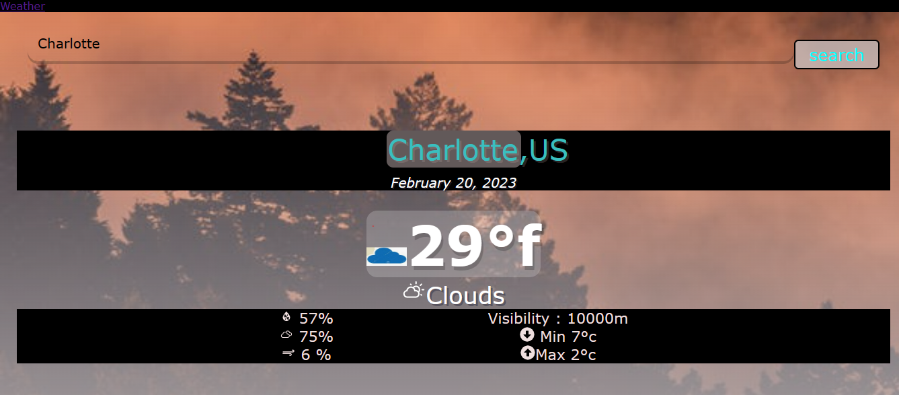

# Title : Weather Application

Access my site at link below  aa

https://luxury-mochi-aaadb5.netlify.app/

# Description:

This project is a working copy of "weather App" which can be used to check weather of city.

Title  : Get Weather

This web based interactive application allows you to search the weather of the city and changes look and feel of the web pages as per the weather condition of the city
Application has a basic feature related to Weather

#Technical Description

This application is developed using React JS.
React is a free and open-source front-end JavaScript library for building user interfaces based on UI components. It is maintained by Meta and a community of individual developers and companies
It is using various feature of the react such as"Components, UseState & useEffect hook "etc...

# Screenshots 

# Technologies 
### HTML 
### CSS 
### JAVASCRIPT 
### REACTJS 
### REACT 
### API Integration

#How to use  

Clone the repository in Visual Code  

Launch the application from Visual Code  

Site can be accessible using below URL on local Machine  

https://luxury-mochi-aaadb5.netlify.app/

#Prerequisite  

To run the site you must Node js installed on your machine

Please use below instruction to install  

Set Up

npm install

To Run Test Suite:

npm test

To Start Server:

npm start

